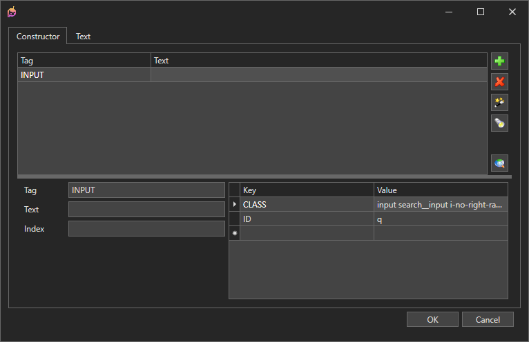

# Web request

.png>)

Element calls the web service via the HTTP protocol.

You can edit the properties of an element in a special window or on the Properties panel. The data specified on the Properties panel are the priority. The editing window is used to specify the constant data and does not allow to use C# expressions. To call the editing window you should click .png>)button.

.png>)

Properties:

&#x20;\- Request variable: \[LTools.Network.Model.TrafficHistoryItem] Variable containing information on the request being made

&#x20;\- URL: \[String] Web Service URL

&#x20;\- Body\*: \[String] Web service request body

&#x20;\- Headers\*: \[IEnumerable\<LTools.Network.Model.PackageHeader>] Web service request header array

&#x20;\- Result\*: \[LTools.Network.Model.TrafficEmitterResponse] Variable to save the results of a Web service request

&#x20;\- Timeout\*: \[Int32] Maximum waiting time for process completion (ms)
