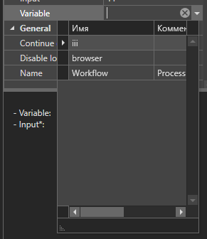
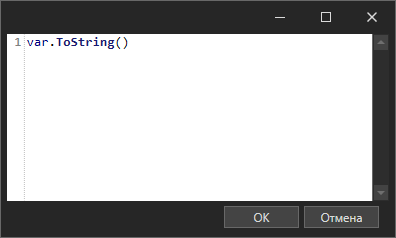

# Working with elements

All process elements available to the user are located on the Elements panel, grouped by subject. There is the Favorites section at the top of the list, which contains frequently used elements.

.png>)

There's also a Favorites group on top. To add an element to this group right-click it and choose "Add to Favorites" item. To remove an element from Favorites right-click it and choose "Remove from Favorites" item.

.png>)

To add an element, drag it from the panel to the needed part of the process or right-click it and choose "Insert after selected". After adding an element to a process, you need to configure its properties. Properties of the element selected at that moment are displayed on the Properties panel.

.png>)

The following information is displayed on the Properties panel:

* Internal name of the element type
* Unique element identifier
* Element properties list
* Brief information on an element

Each type of element has its own set of properties. Common properties are:

* Name: the name of the element displayed in the element header and in the log
* Continue in case of an error: a sign of script execution continuation even if an error has occurred at the execution of this element
* Screenshot on error
* Screenshot on finish

Screenshots will be stored in .Screenshots folder of a given process.

To search for the desired property, you can use the Search menu of the Properties panel.

Properties can be displayed as a normal list or as groups. To switch the modes, the Properties panel has the corresponding buttons: .png>)

You can make changes to the properties not only in the Properties panel, but also in the corresponding slots of an element itself.

.png>)

The properties are divided into three categories:

* Constant
* Variable
* Calculated Value
* Search Template

A constant is a plain text (e.g. Name) or a checkbox (e.g. "Continue in case of an error").

A variable is selected from the process variable list. The property variable looks like a drop-down list.

A calculated value is an expression in language selected for the process (C#, Python, or JavaScript). Even if it is necessary to specify an ordinary line, any text should be enclosed in quotation marks and the special characters inside the line should be escaped according to rules of selected language (the description of languages is not the subject of this manual). The property to be calculated always contains the "..." button.

.png>)

If you press the "..." button, the form for editing an expression will appear.

A Search Template is an expression describing the Element Search Template (pattern). It depends on the type of an element and will be described further.

Some elements contain "Make screenshot" text.

.png>)

When clicking on the text, the user will be given the opportunity to select a screen segment to be used for further display of the element.

.png>)

To manage a screenshot, right-click on it and select "Make Screenshot" or "Clear" in the shortcut menu.
