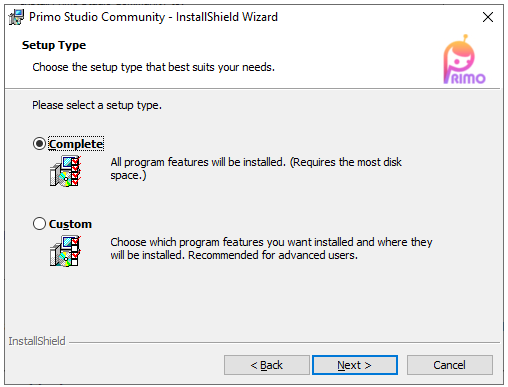

# Installation and updates

> *Before installing, please make note of the [system requirements](https://docs.primo-rpa.ru/primo-rpa-eng/primo-studio/systemreq).*

The installation of the Primo Studio application is performed by an installer, which is run by the setup.exe file. In order for Primo Studio to work correctly, it requires Microsoft.NET Framework 4.6.1, which is installed together with the studio.

Once the installer is started, a standard welcome window will appear.

After clicking Next, the installer will ask you to choose a folder to install Primo Studio.

After clicking Next, you will be asked to choose the setup type and to confirm the start of installation.

The last screen of the installer informs that the installation of the distribution package was completed successfully.

## Startup

Primo RPA Studio is available in [two editions](https://docs.primo-rpa.ru/primo-rpa-eng/primo-studio/editions): 
* Community -  a trial version that has limitations and does not require a license to use it. If that is the edition that you have installed, you can start working with Studio right away. 
* Enterprise - the full version that requires a license. If you have installed the Enterprise edition, please refer to the [Startup](https://docs.primo-rpa.ru/primo-rpa/primo-studio/enterprise) section first.

## Updates 
You can find information about updating Studio, as well as its uninstallation, in [this section](https://docs.primo-rpa.ru/primo-rpa-eng/primo-studio/installation/update).
