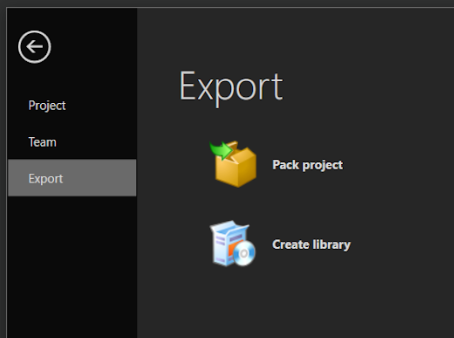
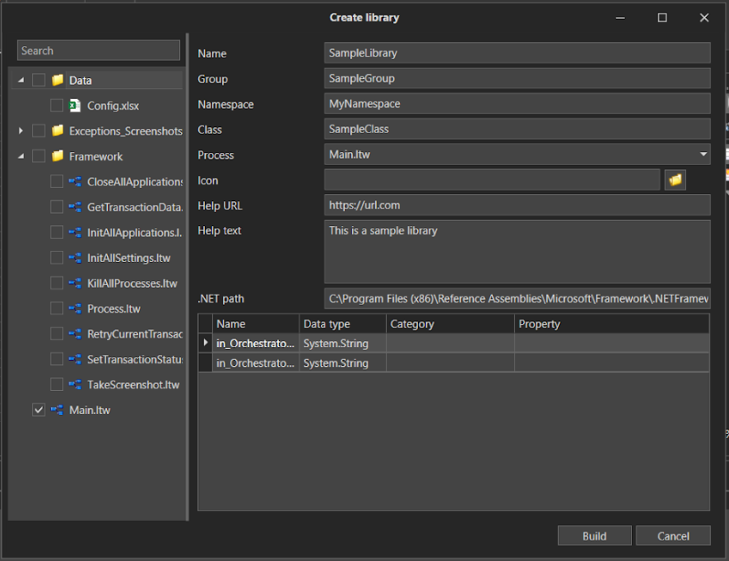

# Creating libraries

Creating a library involves exporting the processes of the current project as a \*.dll file. Subsequently, that file can be used as an element in other projects.

## Preparation

Before exporting a project it is necessary to have .NET Framework 4.6.1 Developer Pack installed on the machine with Primo Studio. 
It can be downloaded from the [official Microsoft website](https://dotnet.microsoft.com/en-us/download/dotnet-framework/net461).

If you export a project without installing the framework, the process will fail with an error.

## Export

To create a library, use **File ➝ Export ➝ Create library**.

<figure><figcaption></figcaption></figure>

A window with library settings will be displayed:

<figure><figcaption></figcaption></figure>

In the project tree that is shown in the left pane of the window, checkmark the processes that need to be exported to the library. 

Next, fill in the fields: 

1. **Name** - the name of the element being created; this name will be displayed in the elements panel.
2. **Group** - the name of the group to which this element will belong in the elements panel. 
3. **Namespace** - namespace name is defined according to the rules of C# language - you can find more details [here](https://learn.microsoft.com/en-us/dotnet/standard/design-guidelines/names-of-namespaces). Only letters and numbers are permitted. The following template specifies the general rule for naming: `<Company>.(<Product>\|<Technology>)[.<Feature>][.<Subnamespace>]`. Examples: `Fabrikam.Math` `Litware.Security`.
4. **Class** - the name of the class, which is defined according to the rules of C# language. Only letters and numbers are permitted. The name should use nouns or a combination of nouns, and the first letter of each word should be capitalized according to the PascalCasing convention. DO NOT use prefixes (such as "C") in class names. More information about class naming can be found [here](https://learn.microsoft.com/en-us/dotnet/standard/design-guidelines/names-of-classes-structs-and-interfaces). Rules of PascalCasing are described [here](https://learn.microsoft.com/en-us/dotnet/standard/design-guidelines/capitalization-conventions).
5. **Process** - select the process that will be performed when this element is called.
6. **Icon, Help URL, Help text** - you can add an icon in \*.png format, specify a link to the help page and the help text itself. These fields are optional.
7. **.NET path** - specify the path to standard .NET libraries in the following format: `<full path>\{0}.dll`. For example: `C:\Program Files (x86)\Reference Assemblies\Microsoft\Framework\.NETFramework\v4.6.1\{0}.dll`. If you do not have such a folder, make sure that you have .NET Framework 4.6.1 Developer Pack installed.

Then specify names and categories for the elements of the start process. This information will be used to display element properties in the property palette.

Once the above is done, press the **Build** button: 

In the dialog, specify the path to save the \*.dll file and its name.

:bangbang: ***File name must start with the word Primo.***

Publishing and linking to the project use the same rules as those for SDK projects.


[publish.md](../../developers/sdk/publish.md)

