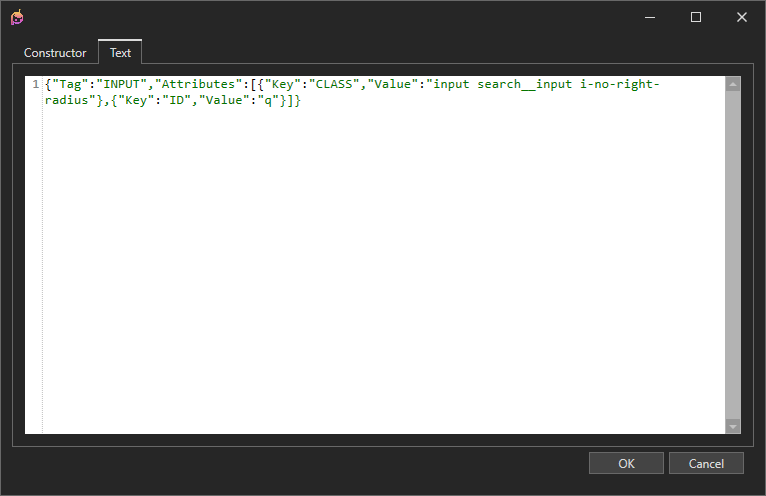

# Search patterns

The property of a search template contains the "..." button, upon clicking which the window of visual editing of a template (depends on the type of an element) will appear.

.png>)

At the moment, the elements of the following categories have search templates:

* Browser Elements Group
* Desktop Elements Group

## Browser

A template for searching for Browser elements looks like this.

.png>)

To add a template element, you should click .png>) button, then select a new line and enter data in the Tag, Text and Index fields. To refine search, you can enter the names and values of the tag attributes in the table (key, value). If you specify several rows, the search of an element in the browser will be carried out depthward starting from the uppermost template.

To delete a template, you can use.png>)button, or press the Del key.

A template can be generated automatically by clicking the "Select a Component" button .png>) and clicking the sought element in the desired browser window. You may also use quick button on element.

If you click the "Display the Component" button.png>), the control element marked in the current template will be highlighted.

The "UI Inspector" button .png>) is used to display/hide the interfaces exploring module.

.png>)

In this module you can examine the application structure. Selected elements are moved to a template using  and .png>) buttons.

A search template is a JSON format string containing all the attributes needed for search. A template can be entered manually by switching over to the Text tab.

## Desktop

A template for searching for Desktop elements looks like this.

.png>)

To add a template element, click .png>) button, then select a new line and enter data in the Name, AutomationID, ClassName, ControlType, LocalizedControlType and Index fields. To refine search, you can enter the names and values of attributes of the sought component in the table (key, value). If you specify several rows, the search for an element in the robotic application will be carried out depthward starting from the uppermost template. For a shorter route select the check box "Quick search".

To delete a template, you can use .png>)button or press the Del key.

A template can be generated automatically by clicking the "Select a Component" button .png>) and clicking the sought element in the desired browser window. You may also use quick button on element.

If you click the "Display the Component" button .png>), the control element marked in the current template will be highlighted.

The "UI Inspector" button .png>) is used to display/hide the interfaces exploring module.

.png>)

In this module you can examine the application structure. Selected elements are moved to a template using .png>) and .png>) buttons.

A search template is a JSON format string containing all the attributes needed for search. A template can be entered manually by switching over to the Text tab.

.png>)

