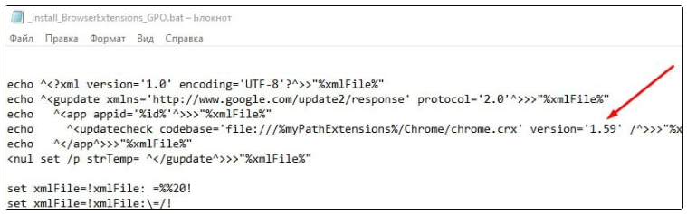

# Auto installation of browser extension 

Interaction of Primo products with Web browsers requires installing **Primo RPA Extension**. It is suitable for the following browsers: Chrome, Firefox, Edge, Yandex.

This section provides information about automating the installation of Primo RPA Extension version 1.59.\*

> \**When extension version is changed from 1.59, it might be necessary to make changes to the script _Install_BrowserExtensions_GPO.bat. More information about it can be found in the subsection [below](https://docs.primo-rpa.ru/primo-rpa/primo-studio/settings/autoinstall-browser-extension#izmenenie-versii-rasshireniya).*

## General

Distribution package of the extension can be found in the `\Extensions` folder of Primo Studio/Primo Robot. These programs should be installed on the computer before installing the extension. 

For Chrome, Edge and Yandex browsers, distribution file `\Extensions\Chrome\chrome.crx` should be used. For Firefox - distribution file `\Extensions\primo_rpa_extension-1.2-fx.xpi`.

The extension can be installed:
* manually, after installing Studio/Robot. Installation instructions can be found [here](https://docs.primo-rpa.ru/primo-rpa/primo-studio/settings/plugin-install);
* automatically - using the scripts **_Install_BrowserExtensions_GPO.bat** and **_InstallWebBrowserNative.bat** described below.

Studio and Robot interact with browsers and their extensions via the file **LTools.WebBrowser.Native.exe**. It is located in the folder with Primo Studio and Primo Robot applications. The extension connects with this file using:
* Windows registry entry, corresponding to the browser and its plugin;
* and the json file that has the path to LTools.WebBrowser.Native.exe. 

If this connection is set up correctly, then when the extension is enabled and the browser is started with a non-blank URL, it will automatically start LTools.WebBrowser.Native.exe. After that, data exchange takes place between the Robot and the browser: the Robot controls the web page, clicks on its HTML elements, refreshes the page, goes to other URL addresses - in other words, performs all actions in accordance with the launched RPA project.

## Automatic installation of the extension

1. Download the archive [InstallExtensions.zip](https://drive.google.com/file/d/1cIXwlojb_9nkF3KSDDsggSldqjjvaScM/view?usp=sharing) and unzip it:

   
   
2. Copy the files **_Install_BrowserExtensions_GPO.bat** and **_InstallWebBrowserNative.bat** into the folder with Studio/Robot program, so that they are placed near the file Primo.Robot.exe - for example, in `C:\Program Files\Primo\Primo Studio`.
3. Run the scripts in succession. 

:bangbang:***The script _Install_BrowserExtensions_GPO.bat should be run with administrator privileges. They are not required to run the second file.***

If the extension has already been installed for the current user, the browser extension menu shows it as enabled, and it is the latest version, then it is sufficient to use only the **_InstallWebBrowserNative.bat** script.

### Alternative method of installation

Copy the files from step 2 into any folder, and subsequently run them with the argument pointing at the Studio/Robot folder (without the slash at the end). For example:
```
C:\Scripts\_InstallWebBrowserNative.bat “C:\Program Files\Primo\Primo Robot x64”
```
### Изменение версии расширения

When extension version is changed from 1.59, it might be necessary to make changes to the script `_Install_BrowserExtensions_GPO.bat`. Open the script file and check the version of the extension being installed. If needed, change it:



## Installation description

The process of auto installation can be divided into two stages:

* installing browser extension so that it is visible and enabled in the browser for the current user;
* connecting the extension with the file LTools.WebBrowser.Native.exe via Windows registry and a json file for each user.

The file **_Install_BrowserExtensions_GPO.bat** is run once on the server. It automatically sets up the group policy for installing the extension for all browsers and for all users under which Primo Robot will be working on the computer (terminal server). It can be run by the user who has administrative privileges on that server. Running this script again is only necessary if the plug-in version is updated in the new Studio/Robot distribution package. Internet connection is not required for installation, which is important for corporate environments.

Forced installation of the extension is based on the group policy [ExtensionInstallForcelist](https://chromeenterprise.google/policies/#ExtensionInstallForcelist).

A similar policy is used for Edge and Yandex. Extension for these browsers is installed from a local file `\Extensions\Chrome\chrome.crx`.

Firefox uses a different policy that is described  [here](https://github.com/mozilla/policy-templates#extensions).
Installation for Firefox is done from the file `\Extensions\primo_rpa_extension-1.2-fx.xpi`.

The script **_InstallWebBrowserNative.bat** is run once ***for each user*** from the folder where the corresponding Primo Robot and its LTools.WebBrowser.Native.exe are located. Running it does not require administrative privileges and can be done manually by double-clicking or by a script, including a Primo process - for example, a task from Orchestrator, if it has not been run yet in the current user profile. Running this script again will be needed only if the user profile is updated for some reason, or if the Studio/Robot folder along with the file LTools.WebBrowser.Native.exe is moved to a different location.

If the extension has already been installed for the current user, the browser extension menu shows it as enabled, and it is the latest version, then it is sufficient to connect it with LTools.WebBrowser.Native.exe, that is, use only the **_InstallWebBrowserNative.bat** script.

When using the scripts it should be noted that only Primo RPA Extension that is registered in [Chrome Web Store](https://chrome.google.com/webstore/detail/primo-rpa-extension/pbdnfhljkbaiibahdfcmgnfpapchlmmp) with the identifier id=`pbdnfhljkbaiibahdfcmgnfpapchlmmp` can be installed 

## Uninstalling the extension

To uninstall the extension for all browsers, use the script **Uninstall_BrowserExtensions.bat**, which was previously extracted from the InstallExtensions.zip archive. You can run this file as administrator from any folder.

This script uninstalls the plug-in from all browsers by reversing the installation changes: it removes the group policy for extension installation, which was enabled by the script _Install_BrowserExtensions_GPO.bat.
