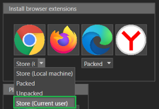
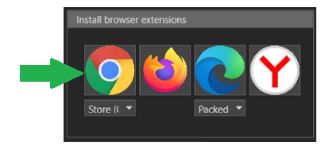
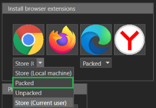
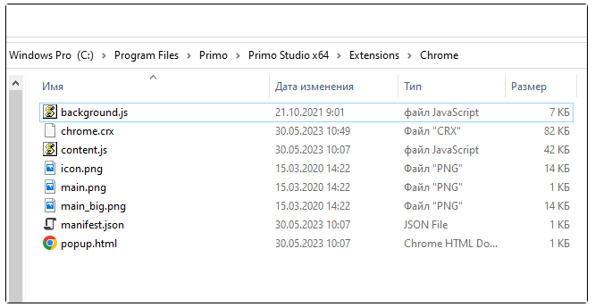
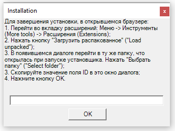
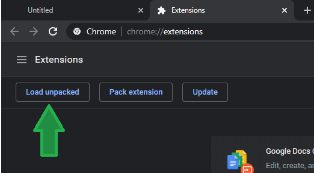
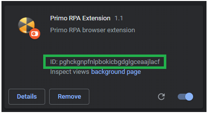
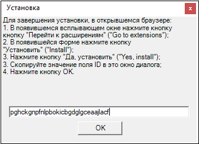

# Chrome

To install Chrome browser extension manually, select **File > Settings > Tools > Extensions**. Further steps depend on the chosen installation method.

### Recommendations

The extension needs to be reinstalled after every Studio update. Reinstallation can be avoided by adhering to the updating [recommendations](https://docs.primo-rpa.ru/primo-rpa-eng/primo-studio/installation/update) that concern the file `manifest_ch.json`. 

An exception is the situation where the extension was installed using [scripts](https://docs.primo-rpa.ru/primo-rpa-eng/primo-studio/settings/autoinstall-browser-extension).

## Installation methods

### Store (current user)

This is the default installation method. It requires an internet connection.

1. In Studio settings, under the Chrome browser icon, select **Store (current user)** from the drop-down list. This is the extension installation mode.

   

2. Click on the Chrome icon:

   
   
3. The extension will be automatically installed from the [Chrome Web store](https://chrome.google.com/webstore/detail/primo-rpa-extension/pbdnfhljkbaiibahdfcmgnfpapchlmmp) and registered in the current user branch of the Windows registry.

### Packed extension

This installation method does not require an internet connection. 

1. Under the Chrome browser icon, select **Packed** from the drop-down list: 

   

2. Click on the Chrome browser icon - a window with the saved extension files will be opened, along with an instance of Chrome:

   
   
3. In Chrome, go to **Settings > Extensions > Manage Extensions**.
4. Drag the file `chrome.crx` into the Chrome window.
5. Press **Install extension** button.

### Unpacked extension

This installation method does not require an internet connection. 

1. Under the Chrome browser icon, select **Unpacked** from the drop-down list.
2. Click on the Chrome browser icon - this will open:
   * an instance of Chrome;
   * a window with the saved extension files;
  
 

   * installation window with instructions and an input field - for the moment, do not do anything with it:;
 
 

3. In Chrome, go to **Settings > Extensions > Manage extensions**.
4. Press **Load unpacked** button.  
 :small_blue_diamond: *If this button is not displayed, enable Developer mode by switching the toggle in the top right corner of the screen.*

 

5. Make sure that the window shows the path to the saved extension files and press **Select Folder** button. Example of the path: `C:\Program Files\Primo\Primo Studio x64\Extensions\Chrome`:

 

6. In the Chrome extensions section, copy the ID of the installed extension. If the ID is not fully visible, press **Details** button:

 

7. Paste the copied ID into the installation window (see item 2 above) and press **OK**:

 

### Store (Local machine)

 This installation method requires an internet connection.

1. In Studio settings, under the Chrome browser icon, select **Store (local machine)** from the drop-down list..
2. Click on the Chrome browser button.
3. The extension will be automatically installed from the [Chrome Web store](https://chrome.google.com/webstore/detail/primo-rpa-extension/pbdnfhljkbaiibahdfcmgnfpapchlmmp) and registered in the branch of the Windows registry. 
