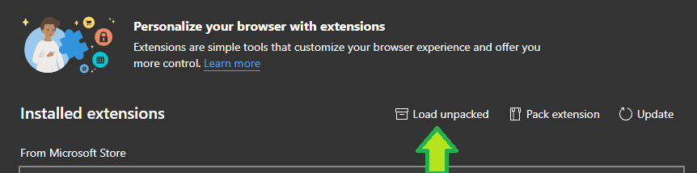
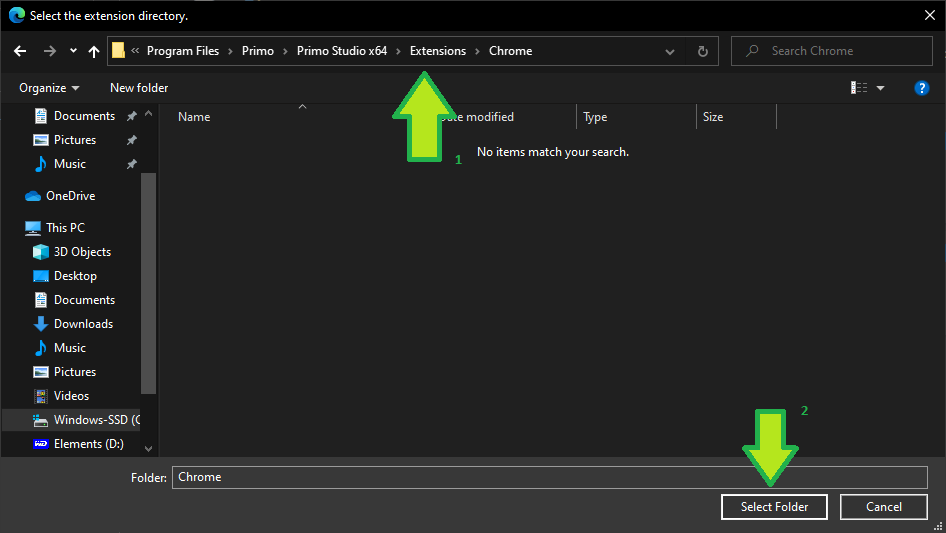
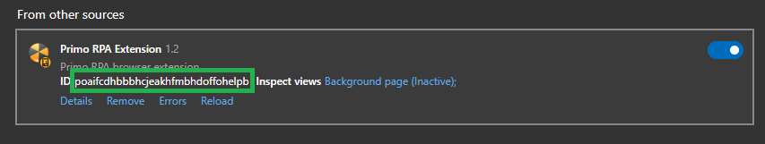
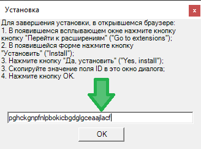

# Edge

## Упакованное расширение

* In Studio, open **File > Settings > Tools > Extensions**.
* Under the **Edge** icon, select `Packed` from the dropdown list, then click on the browser icon itself.
* A window with the saved extension files will be opened.
* In the Edge browser settings, select **Extensions** menu item.
* Drag and drop the file `chrome.crx` onto the Edge window.
* A window will be opened - click on **Add extension** button.

## Unpacked extension

To install the unpacked Edge extension:

* In Studio, open **File > Settings > Tools > Extensions**. Under the **Edge** icon, select `Unpacked` from the dropdown list, then click on the browser icon itself. 
* This will open an instance of Edge, a window with extension files, and the Installation dialog.
* In the Edge browser settings, select **Extensions** menu item.
* A window will be opened - click on the **Load unpacked** button:
  > *If this button is not displayed, enable Developer mode by switching the toggle in the top right corner of the screen.*

* Select the directory where the extension file was saved

* A window will be opened - copy the value in its ID field and paste it into the dialog box, then click OK.

* The extension will be installed.

You can verify that the extension is successfully installed by going to the Extensions section of browser settings.

