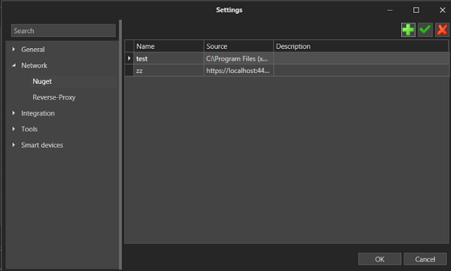

# NuGet

Primo Studio has the option for connecting your own sources of NuGet packages. This can be done using one of the two methods:
* in Studio, in the **File > Settings > Network > Nuget** section;
* using the global NuGet configuration: see [this Microsoft article](https://learn.microsoft.com/en-us/nuget/reference/cli-reference/cli-ref-sources) for more information.

## Establishing a connection from Studio

1. Open **File > Settings > Network > Nuget**.
2. Source management is done using «Create», «Edit», «Delete» buttons that are shown as icons in the top right corner of the dialog:

<figure><figcaption></figcaption></figure>

3. Clicking the **Create** button opens a dialog with source settings. Two fields are mandatory: **Name** and **Source**, other fields are optional.

<figure><figcaption></figcaption></figure>

4. After saving the settings, the new source will be available in the [Manage dependencies](https://docs.primo-rpa.ru/primo-rpa/primo-studio/projects/manage-dependencies#menedzher-zavisimostei) window. Example:

## Additional information 
The [local NuGet server](https://docs.primo-rpa.ru/primo-rpa/orchestrator/settings/nuget), which is a part of the Orchestrator package, can also be specified as the source.
